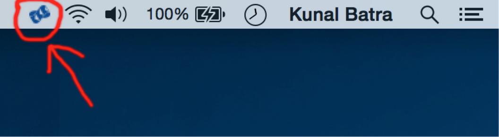
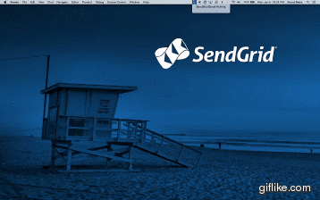

# FireGrid
OSX menu tray application that displays a live stream of SendGrid event webhook data with the aid of Firebase

## Setup
0. Create a new [Firebase](https://www.firebase.com/).
0. Create an account on [SendGrid](https://www.sendgrid.com/free).
0. Clone this repo and customize firegrid.py and AppDelegate.m 
0. Run firegrid.py on a server. I've used the Google cloud.
0. Use the URL firegrid.py lives on and set it up with the SendGrid Event Webhook.

## Questions
If you have any questions email kunal@sendgrid.com

